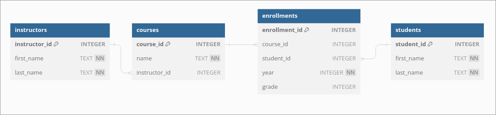

### The problem - FRI course registration system
Design a database to manage student enrollments to different courses and their achieved grades. The system should store information about the students, the courses, the instructors as well as student enrollments (and grades).

Designing databases is hard, and there are jobs/career paths that specialize only in database design/admin, so do not underestimate this task.

### The proposed schema

Drawn with [dbdiagram.io](https://dbdiagram.io/).

The schema shows 4 tables. Initially, reading the problem definition, one might think we only need 3 tables (Courses, Students, Instructors). However, if we examine the relationship cardinalities:
- Courses-Instructors = N:1 (each course has exactly one instructor, but each instructor may teach multiple courses),
- Courses-Students = N:M (each course can have multiple students, and each student can be enrolled in multiple courses).

Many-to-many relationships (N:M) in relational databases are modeled by introducing a new table C, such that A:C has cardinality 1:M and C:B has cardinality N:1. Conveniently, rows in this intermediary table have a practical meaning (mapping) - enrollments. Also notice how we have already defined the data types - relational databases require such rigorous definitions ahead of time to ensure that all data is in a consistent format later (otherwise the transaction fails).

Database schema design is much more in depth than what we will show (e.g. notice how the arrows connecting the tables above have different signs on the ends - this is to model the cardinality of the relationship). There are also multiple levels we can model on (logical, physical, conceptual). Should you want to know more, take a look [here](https://en.wikipedia.org/wiki/Entity%E2%80%93relationship_model).

### Creating the database
We will use sqlite. We will do everything without SQLAlchemy as the course will test your SQL skills and SQLAlchemy abstracts a lot of SQL away.
